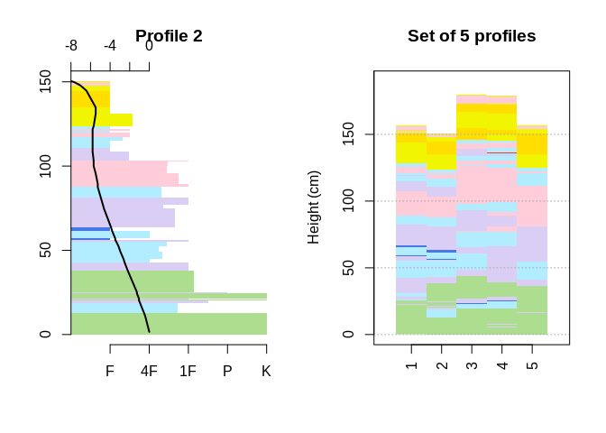

# sarp.snowprofile.alignment

The goal of sarp.snowprofile.alignment is to

  - align snow profiles by matching their individual layers based on
    Dynamic Time Warping (DTW)
  - assess the similarity of the aligned profiles with an independent
    similarity measure that is geared towards avalanche hazard
    assessment
  - cluster sets of snow profiles according to similar conditions based
    on the independent similarity measure, and
  - aggregate clusters of snow profiles to summarize the conditions by
    the most representative (medoid) profile

**Background:** Snow profiles describe the vertical (1D) stratigraphy of
layered snow with different layer characteristics, such as grain type,
hardness, deposition/burial date, and many more. Hence, they represent a
data format similar to multi-variate time series containing categorical,
ordinal, and numerical data types.

## Installation

You can install the CRAN release of this package with 
`install_packages('sarp.snowprofile.alignment')` or get the most 
recent version from our bitbucket repository with:

``` r
devtools::install_bitbucket('sfu-arp/sarp.snowprofile.alignment', ref = 'master')
```

## Example

### Aligning pairs of snow profiles

``` r
library(sarp.snowprofile.alignment)
#> Loading required package: sarp.snowprofile

plotSPalignment(SPpairs$D_generalAlignment1, SPpairs$D_generalAlignment2)
```


The corresponding layers between the two snow profiles `query` and
`reference` have been matched, and the layer thicknesses of the `query`
profile have been adjusted, so that the `warped query` is optimally
aligned with the `query`.

### Clustering snow profiles and finding a representative profile

Consider a (very) short list of 5 snow profiles:

``` r
setSP <- SPgroup[c(1, 2, 5, 6, 7)]
par(mfrow = c(1, 2))
plot(setSP[[2]], main = "Profile 2")
plot(setSP, SortMethod = 'unsorted', labelOriginalIndices = TRUE, main = "Set of 5 profiles")
```



Compute the snow profile that represents the group the best by aligning
the profiles and assessing their similarity:

``` r
idxMedoid <- medoidSP(setSP)
#> You are about to compute 5^2 = 25 profile alignments. This will take roughly 7.5 seconds, depending on the profile depths and resampling rate. Starting now..
#> Computed pairwise distance matrix. It actually took 
#> Time difference of 5.391558 secs
#> 5.391558
paste("The most representative profile is Profile", idxMedoid)
#> [1] "The most representative profile is Profile 2"
```

The last computation told us the most **representative profile**: It is
**Profile 2**, which we have plotted earlier.

## Getting started

A broader and deeper overview of the package is provided in the
vignettes, cf. `browseVignettes("sarp.snowprofile.alignment"))`. For a
quick start, see `?sarp.snowprofile.alignment`. This package builds on
top of the general package `sarp.snowprofile` for data import/export and
manipulation, cf. `browseVignettes("sarp.snowprofile"))`.
